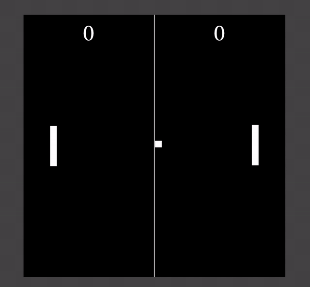

## Introduction

This is a [Pong](https://en.wikipedia.org/wiki/Pong) clone written in Elm

[Try the Game here!](https://animind.space/) (Use the Up and Down arrow keys to control the paddle)

It utilizes the [Elm-playground](https://package.elm-lang.org/packages/evancz/elm-playground/latest/) module to create a game with:
* Collision detection logic
* Scoring
* Animation
* Keyboard Controls
